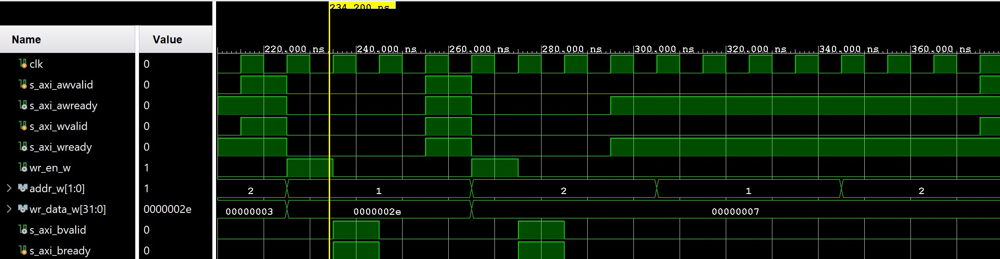
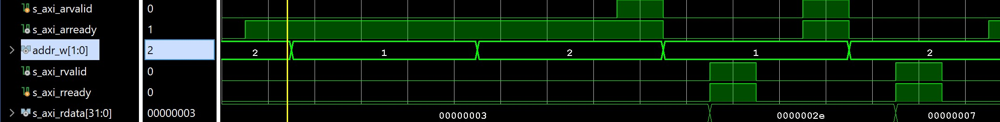
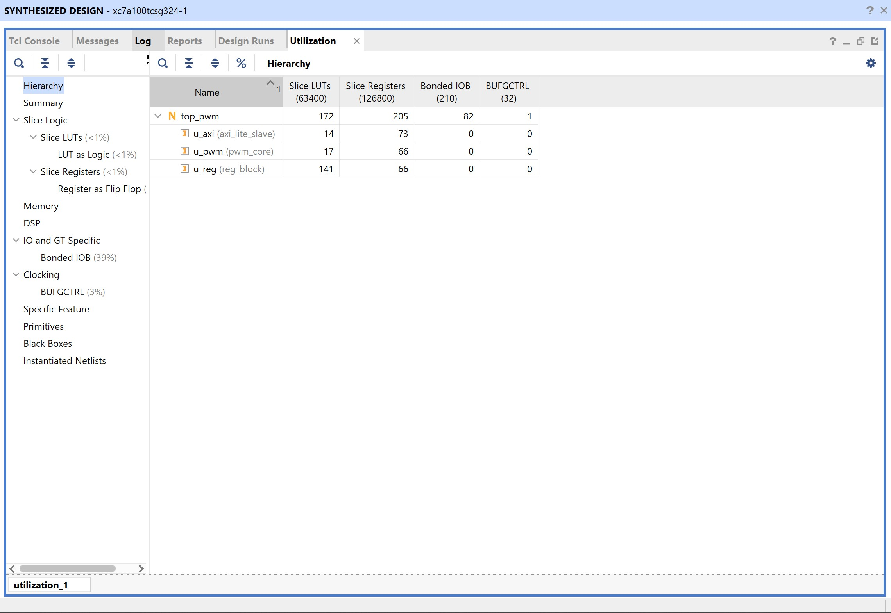
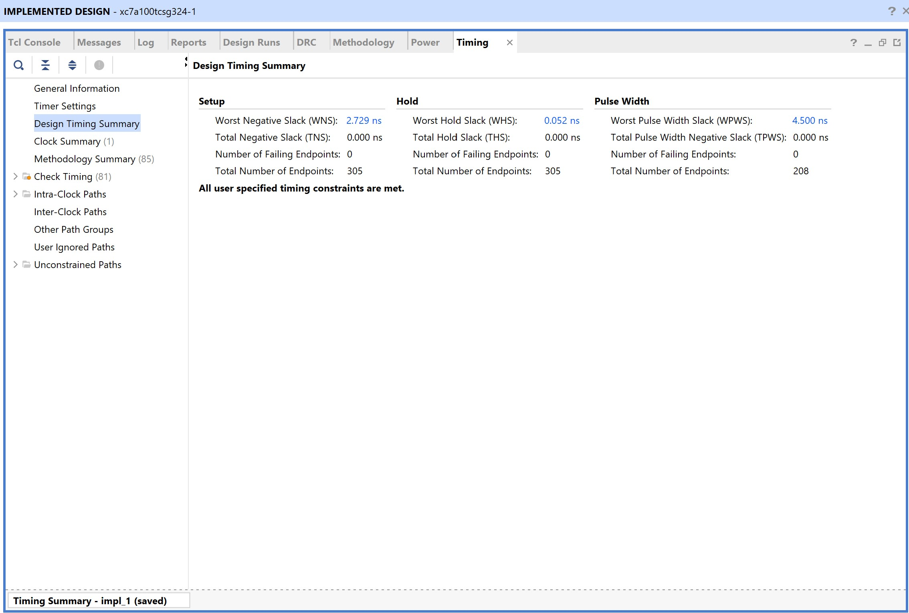

# AXI4-Lite Memory-Mapped PWM (Artix-7 FPGA)

A modular AXI4-Lite compliant PWM peripheral implemented in Verilog.
The design integrates an AXI slave FSM, memory-mapped register block, and PWM core.

Target Tool: Vivado 2024.2  
Target Device: Xilinx Artix-7 (xc7a100t)

---

## Architecture

AXI Slave FSM → Register Block → PWM Core → pwm_out

### AXI4-Lite Slave
- FSM-based implementation
- Ready/Valid handshake protocol
- Separate WRITE and READ channel handling
- Word-aligned address decoding (`addr = axi_addr[3:2]`)

### Register Block
- CTRL register (enable)
- PERIOD register (32-bit)
- DUTY register (32-bit)
- Optional STATUS register (done flag)
- Synchronous write path
- Combinational read mux

### PWM Core
- Counter-based PWM generation
- Duty-cycle saturation protection
- Period=0 protection logic

---

## Memory Map

| Word Addr | Byte Addr | Register | Description |
|-----------|-----------|----------|-------------|
| 2'b00 | 0x00 | CTRL   | Enable bit |
| 2'b01 | 0x04 | PERIOD | PWM period |
| 2'b10 | 0x08 | DUTY   | PWM duty |
| 2'b11 | 0x0C | STATUS | Done flag |

---

## Verification Strategy

- Self-checking testbench
- Directed read/write validation
- Randomized stress testing (20 iterations)
- Waveform-level AXI handshake verification

All AXI read/write tests pass.

---

## Simulation Results

### AXI Write Handshake

### AXI Read Handshake

---

## FPGA Results (Artix-7)

### Resource Utilization
- LUTs: 172
- Registers: 205
- BUFG: 1

### Timing Summary (100 MHz Constraint)
- Clock constraint: 10 ns
- Post-Implementation WNS: +2.729 ns
- All timing constraints met

---

## Key Debugging & Fixes

### Port Mismatch Errors
- Fixed incorrect port names in testbench instantiation.

### Unknown (X) Waveform Values
- Ensured proper reset sequencing.
- Verified valid/ready handshake completion.
- Initialized AXI signals before reset release.

### Width Mismatch Warnings
- Corrected signal bit-width mismatches (addr[1:0], wr_data[31:0]).

### reg_block Read Logic Bug
- Separated combinational read logic from sequential write block.

### Timing Constraint Missing
- Added XDC clock constraint:
  create_clock -period 10.000 [get_ports clk]

---

## Tools Used
- Vivado 2024.2
- Verilog RTL
- XSim Simulation
